```{r setup, include=FALSE}
options(htmltools.dir.version = FALSE)
# library(RefManageR)
# RefManageR::BibOptions(check.entries = FALSE, bib.style = "authoryear", style = "markdown",
#            dashed = TRUE)
# # file.name <- system.file(getwd(), "kirjandus.bib", package = "RefManageR")
# bib <- RefManageR::ReadBib("C:/teaching/andmeteadus_ja_dh/kirjandus.bib")
```


class: inverse, center, middle
layout: false

<iframe width="900" height="506" src="https://www.youtube.com/embed/uV54oa0SyMc?list=PL97MyLoP55qrOlsguBWxeUqAgciktCZy1" frameborder="0" allow="accelerometer; autoplay; clipboard-write; encrypted-media; gyroscope; picture-in-picture" allowfullscreen></iframe>

---
class: inverse, center, middle

# Mis on agendipõhine mudeldamine?

--

Mudel on mingi reaalse süsteemi sihipärane (lihtsustatud) kujutamine.

--

Arvutisimulatsiooni meetod, mis sobib eriti hästi selleks, et uurida ja avastada, kuidas mingi süsteemi koondomadused kerkivad esile selle osade käitumise tulemusena. Need osad on ongi agendid.

--

Arusaam, et suurt osa nähtuseid saab mudeldada kui agente, keskkonda ja nende omavahelisi suhteid.

---

# Miks on seda vaja? 

.pull-left[
Võimaldab mudeldada huviobjekte erinevatena.

Võimaldab väljendada käitumisi väga lihtsate reeglite abil.

Protsessi kirjeldamine läbi indiviidi on arusaadavam ning teeb tulemuste kommunikeerimise lihtsamaks.

Simulatsiooni loomine nõuab, et kogu (kontseptuaalne) mudel kirjeldatakse matemaatilisel viisil. 

Võimaldab luua ja arendada ühiskondi alt üles ja nn virtuaalses laboratooriumis.

Aitab testida hüpoteese ning arendada teoreetilisi arusaamu.
]

.pull-right[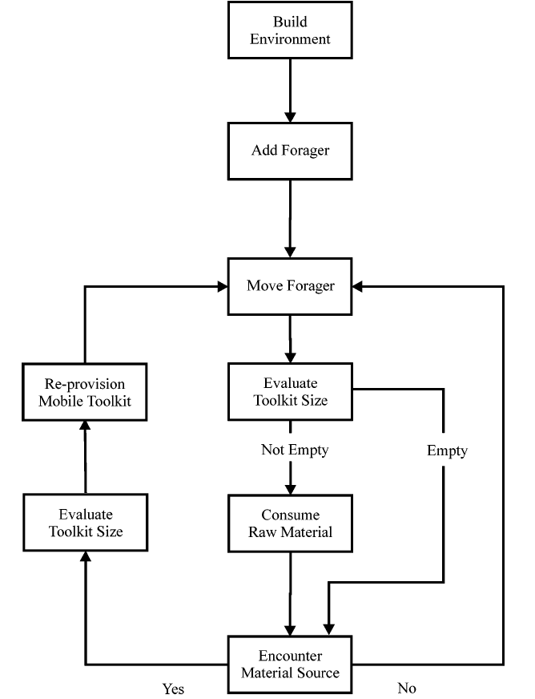.caption[Vooskeem e *flowchart* toormaterjali hankimisest kiviajal (Brantingham 2003, jn 5)]]

???

Matemaatiline kirjeldamine aitab oluliselt ka mudelit paremini lahti mõtestada. Aitab välja tuua eelduseid, mida muidu ei tuvastaks.

---
# Agendid

.pull-left[

- Autonoomnsed
- Heterogeensed
- Üksikindiviid, -objekt
- Kindlad omadused
- Kindlad tegevused ja eesmärgid
]

.pull-right[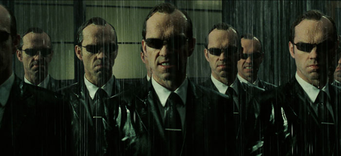 ]

---
# Keskkond

.pull-left[
- Maastik, kus agendid tegutsevad
- Geomeetriline 
- Võrgustikupõhine
- Reaalset maailma kujutav
]

.pull-right[
]

---

# Reeglid

- Panevad paika, kuidas agendid omavahel ja keskkonnaga suhtlevad
- Tulemusena agendid uuendavad oma olekut ja teevad uusi otsuseid

.center[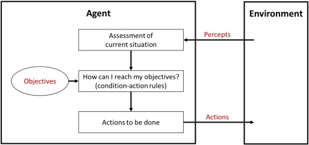]

---

class: center

# Mudeldamise protsess 

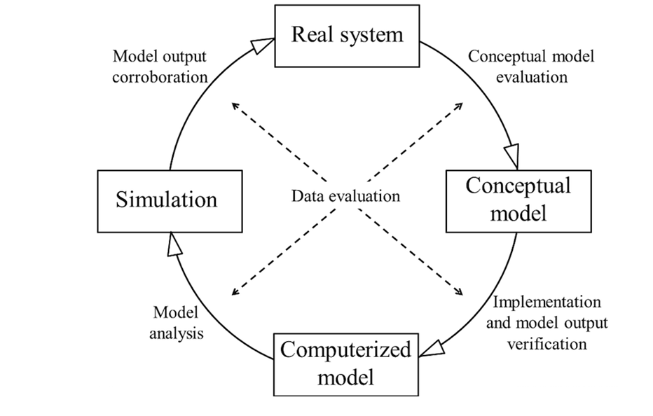.caption[Mudeldamise protsess (Schulze et al. 2017, jn 1)]

---

class: center

# Mudeldamise protsess

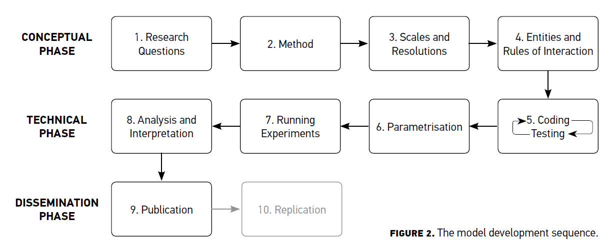.caption[Mudeli loomine (Romanowska 2015, jn 2)]

---

class: center

# Valideerimine

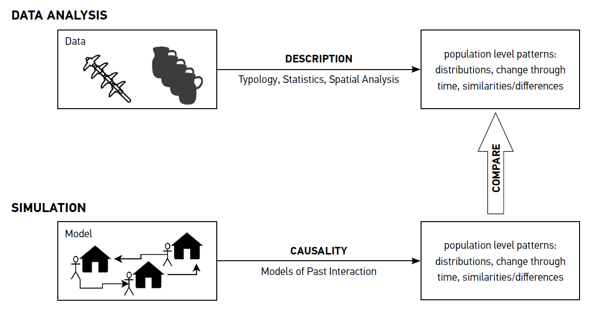.caption[Andmeanalüüsi ja simulatsioonide vaheline suhe (Romanowska 2015, jn 1)]

---

# Otsustusprotsess

.center[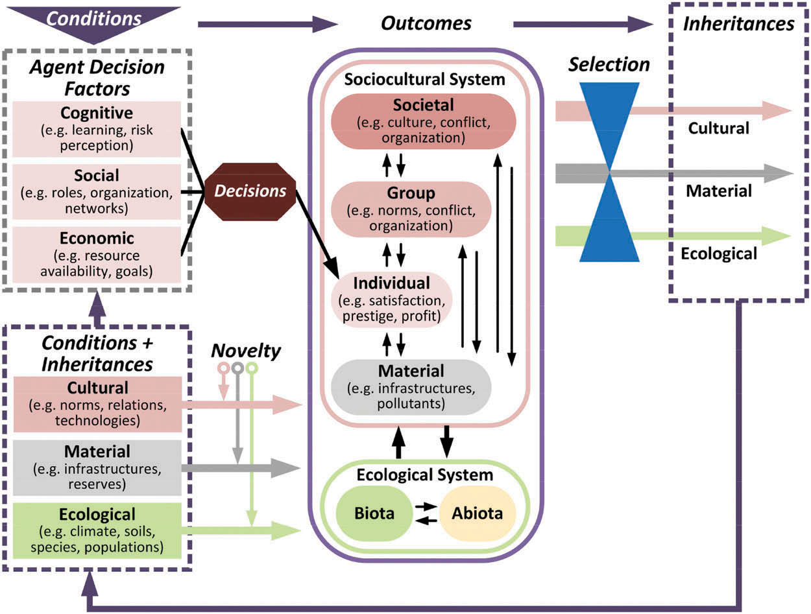.caption[Agentide otsuste tegemise raamistik (Magliocca & Ellis 2016, jn 3)]]

---
# Agendipõhise mudeldamise tarkvara Netlogo

.pull-left[
- agendipõhiseks mudeldamiseks loodud
- lihtsasti õpitav
- koodipõhine
- vabavara

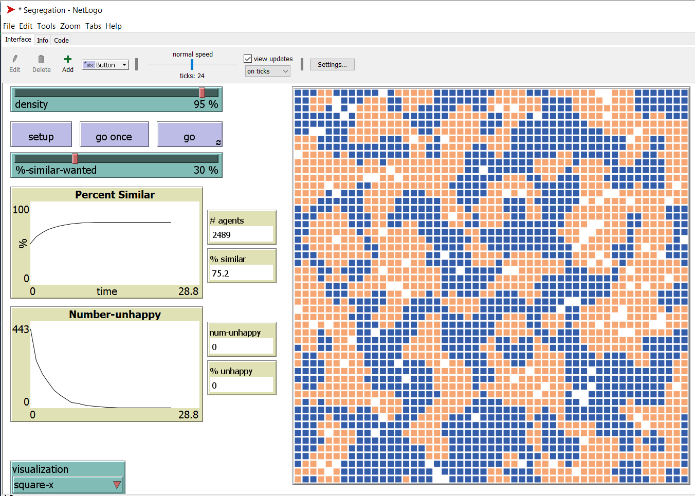
]

.pull-right[ 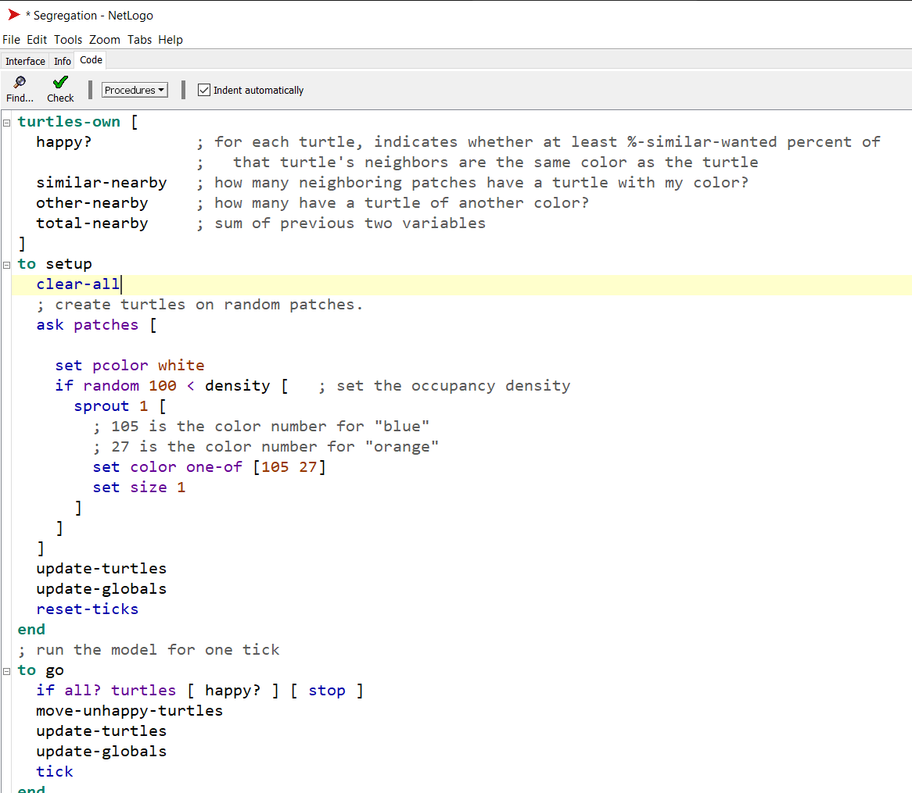]


---
# Vaatame näiteid

- Metsapõleng - kuidas sõltub metsapõlengu ulatus metsatiheduses ja leviku tõenäosusest
- Pidu - kuidas tekivad erineva soolise kooslusega grupid vastavalt liikmete tolerantsile vastassoo suhtes 
- [Schellingu segregatsiooni mudel](https://en.wikipedia.org/wiki/Schelling%27s_model_of_segregation) - kuidas mõjutab soov elada endaga sarnaste läheduses segregeerumist linnades 

---

# Varane põllumajandus ja maakatte muutused 

.pull-left[
- Mudeli tutvustus [arheoloogia aastakirja Tutulus Facebooki lehel](https://www.facebook.com/ajakiritutulus/videos/1552874024868993/?extid=RS7z8c2qGriCW9Yr)
- Milline inimtegevus põhjustab maakatte muutuseid?
- Kui palju inimesi? 
- Kui intensiivne põllumajandus? 
- Millised tegurid kõige olulisemad?
- Kas varasemad tõlgendused on realistlikud? 
]
.pull-right[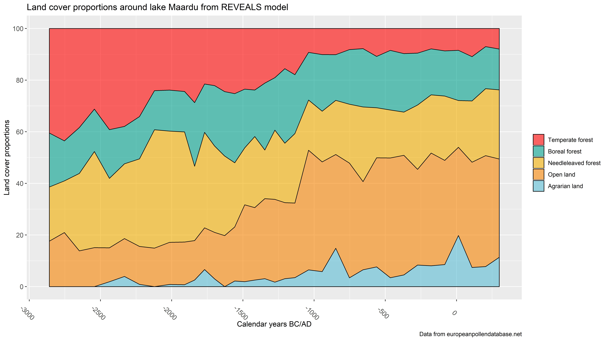]

<!-- --- -->

<!--  -->

---

# Varane põllumajandus ja maakatte muutused

.pull-left[
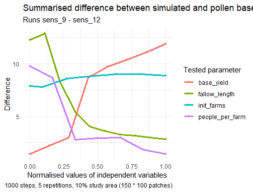
.caption[]
]

.pull-right[
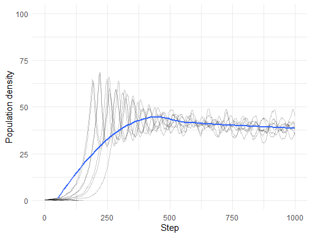
.caption[]
]

---

# Kirjandus

.pull-left[
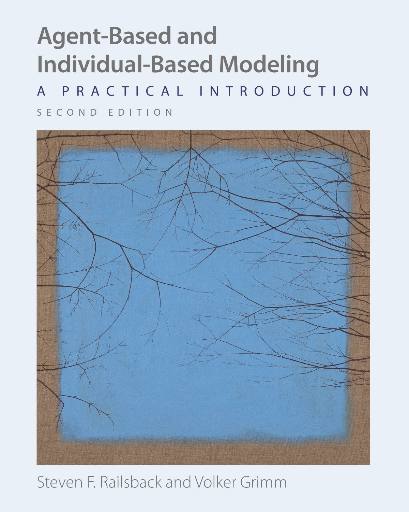
.caption[Väga laialt kasutatud õpik]
]

.pull-right[
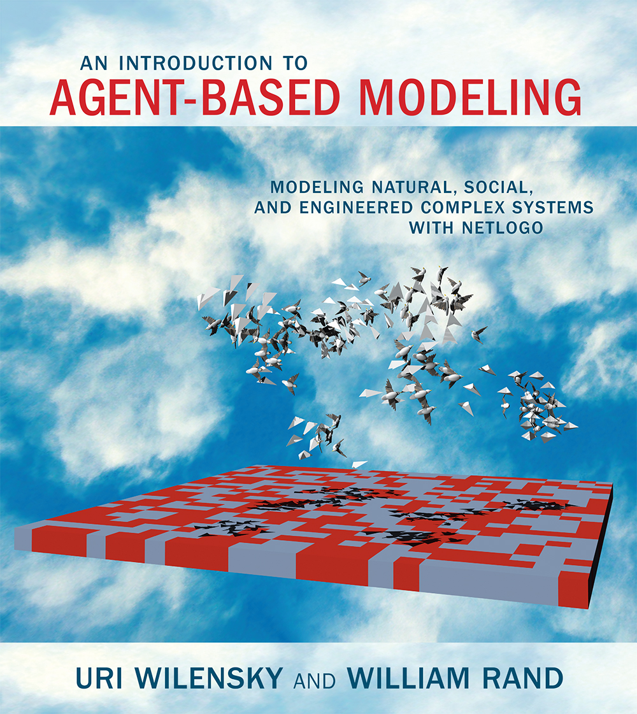
.caption[Netlogo looja õpik tarkvara kasutamiseks
]]

---
# Järgmiseks korraks 

.pull-left[

**Lugeda:**

- Nigel Gilbert. (2008). Agent-Based Models (2nd ed.). Sage Publishing. Lk 2-18. Fail Moodle'is

<!-- **Mõelda** -->

<!-- - Mudelite loomise võimalus oma erialal?  -->
<!-- - -->
<!-- -  -->

]

.pull-right[

**Vaadata:**
<iframe width="213" height="120" src="https://www.youtube.com/embed/VooETfsDErM" frameborder="0" allow="accelerometer; autoplay; clipboard-write; encrypted-media; gyroscope; picture-in-picture" allowfullscreen></iframe>
<iframe width="213" height="120" src="https://www.youtube.com/embed/0ZGbIKd0XrM" frameborder="0" allow="accelerometer; autoplay; clipboard-write; encrypted-media; gyroscope; picture-in-picture" allowfullscreen></iframe>
<iframe width="213" height="120" src="https://www.youtube.com/embed/16W7c0mb-rE" frameborder="0" allow="accelerometer; autoplay; clipboard-write; encrypted-media; gyroscope; picture-in-picture" allowfullscreen></iframe>
]
---
# Kirjandus

.pull-left[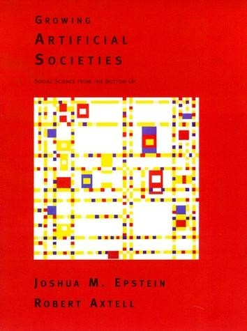.caption[Virtuaalsete ühiskondade loomise alustekst]]

.pull-right[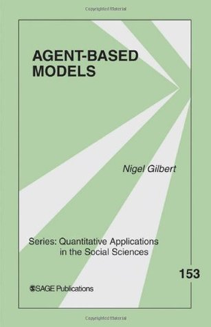.caption[Lühike meetodi ülevaade]]

---

# Rühmatöö

Võib teha üksi või kaks kuni kolm inimest koos. 

Loome kontseptuaalse mudeli poes käimisest. Millised peaksid olema keskkond, agendid ja nende vahelised reeglid, ajamõõde. Eesmärk mõista toidupoodide külastamise aegasid? Mis küsimusi saame veel küsida?

Teine võimalus. Loome kontseptuaalse mudeli oravate seemnete ja pähklite kogumisest, millest rääkisime loengus. Oravad nimelt koguvad toitu, peidavad seda, teesklevad peitmist, unustavad, kuhu nad on toitu peitnud ning otsivad seda nn tõenäolistest kohtadest. Kui palju peaks oravad igale tegevusele keskenduma? Milliste parameetrite ja nende väärtuste juures on oravad siiani elus püsinud?  

---

# Järgmiseks seminariks (25.09) 

.pull-left[

**Lugeda:**

- Nigel Gilbert. (2008). Agent-Based Models (2nd ed.). Sage Publishing. Lk 2-18. Fail Moodle'is. Näidetest lugeda 1.2.1 Urban Models ja 1.2.2 Opinion Dynamics

]

.pull-right[

**Vaadata:**
<iframe width="213" height="120" src="https://www.youtube.com/embed/VooETfsDErM" frameborder="0" allow="accelerometer; autoplay; clipboard-write; encrypted-media; gyroscope; picture-in-picture" allowfullscreen></iframe>
<iframe width="213" height="120" src="https://www.youtube.com/embed/0ZGbIKd0XrM" frameborder="0" allow="accelerometer; autoplay; clipboard-write; encrypted-media; gyroscope; picture-in-picture" allowfullscreen></iframe>
<iframe width="213" height="120" src="https://www.youtube.com/embed/16W7c0mb-rE" frameborder="0" allow="accelerometer; autoplay; clipboard-write; encrypted-media; gyroscope; picture-in-picture" allowfullscreen></iframe>
]

---

# Järgmiseks seminariks (25.09) 

**Mõelda:**

- Kuidas segregatsioonimudel aitab kaasa probleemi lahendamisele? Mida tuleks mudelisse lisada? 
- Mis on emergentsus (*emergence*)? Kas seda esineb sinu erialal või uurimisteemas?
- Kuidas panustab agendipõhine mudeldamine humanitaarteaduste metodoloogilisse arengusse? 
- Mudelite loomise võimalus oma erialal? Mis andmed ja küsimused?
- Kuidas vastata sagedasele kriitikale, mille kohaselt ei saa me kunagi päris maailma mudeldada, kuna tegureid on liiga palju?

---

# Viited

- Brantingham, P. J. (2003). A Neutral Model of Stone Raw Material Procurement. American Antiquity, 68(3), 487–509. https://doi.org/10.2307/3557105
- Epstein, J. M., & Axtell, R. L. (1996). Growing Artificial Societies. Social Science from the Bottom Up. MIT Press.
- Gilbert, N. (2008). Agent-Based Models (2nd ed.). Sage Publishing
- Magliocca, N. R., Brown, D. G., & Ellis, E. C. (2013). Exploring Agricultural Livelihood Transitions with an Agent-Based Virtual Laboratory: Global Forces to Local Decision-Making. PLoS ONE, 8(9), e73241. https://doi.org/10.1371/journal.pone.0073241
- Railsback, S. F., & Grimm, V. (2019). Agent-Based and Individual-Based Modeling: A Practical Introduction (2nd ed.).
- Romanowska, I. (2015). So You Think You Can Model ? A Guide to Building and Evaluating Archaeological Simulation Models of Dispersals. Human Biology Open Access, 87(3), 169–192. https://doi.org/10.13110/humanbiology.87.3.0169??
- Schulze, J., Müller, B., Groeneveld, J., & Grimm, V. (2017). Agent-based modelling of social-ecological systems: Achievements, challenges, and a way forward. JASSS, 20(2). https://doi.org/10.18564/jasss.3423
- Wilensky, U., & Rand, W. (2015). An Introduction to Agent-Based Modeling: Modeling Natural, Social, and Engineered Complex Systems with NetLogo. MIT Press

---

class: inverse, middle, center


# Tänan tähelepanu eest! 

andres.kimber@ut.ee

twitter.com/andreskimber